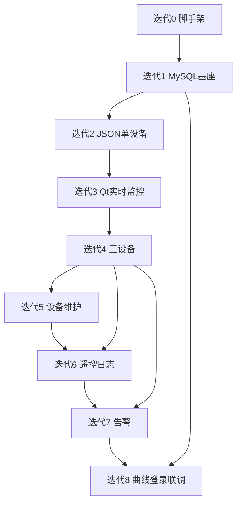

# 分阶段迭代路线

> 原则：**每个迭代结束都能单独演示**，形成可交付增量。  
> 迭代 0 已完成（仓库脚手架）；迭代 1–8 为后续开发顺序。

## 总览

| 迭代 | 名称 | 演示亮点（30 秒内能说清） |
|------|------|---------------------------|
| 0 | 脚手架 | 三程序能启动，协议桩可编解码 |
| 1 | 数据与配置基座 | MySQL 有表有种子，主站启动打印设备列表 |
| 2 | JSON 单设备链路 | 主站经 JsonProtocol 收 1 台模拟器周期遥测 |
| 3 | Qt 实时监控 | 界面看到电压/电流/开关刷新（至少 1 台） |
| 4 | 三设备 + 在线状态 | 3 台设备同时在线，绿/灰状态正确 |
| 5 | 设备与测点维护 | Qt 增删改设备，重启主站后按新配置连接 |
| 6 | 遥控与操作日志 | 合闸/分闸确认后状态变化，MySQL 有日志 |
| 7 | 告警 | 越限变红、通信中断变灰，告警列表可查 |
| 8 | 历史曲线 + 登录 + 终态联调 | 曲线查询、登录流程、完整演示脚本 |

建议周期（参考 8 周计划）：迭代 1–2 约 2 周，3–4 约 2 周，5–6 约 2 周，7–8 约 2 周；可按进度压缩或延长 2–3 天。

---

## 迭代 0：脚手架（已完成）

### 目标

- CMake 多目标、`common` 协议桩、三端启动类。

### 交付物

- `master-server`、`device-simulator`、`qt-client` 可编译运行。

### 演示步骤

```text
1. 构建三目标
2. 运行 master-server / device-simulator → 控制台见 stub 日志
3. 运行 qt-client → 空主窗口与状态栏
```

### 完成标准

- [x] 目录与 CMake
- [x] `MasterApplication` / `SimulatorApplication` / `MainWindow`
- [x] `common` 中 `TELEM` 编解码（C++11；后续 104 上线后保留作主站→Qt 或废弃）
- [x] `qt-client/ui/MainWindow.ui` + 代码混合（见 coding-standards.md）

---

## 迭代 1：数据与配置基座

### 目标

- MySQL 建库建表；种子 3 设备 + 测点；主站读配置。

### 交付物

| 路径 | 内容 |
|------|------|
| `docs/sql/` | `schema.sql`、`seed.sql` |
| `master-server/src/storage/` | MySQL 连接、DeviceRepository |
| `master-server` | 启动时加载并打印设备/测点 |

### 演示步骤

```text
1. 执行 schema + seed
2. 启动 master-server
3. 控制台输出 3 台设备名称、IP、端口、测点数量
4. （可选）MySQL Workbench 展示 device/point 表
```

### 完成标准

- [x] 5 张业务表创建成功（device, point, telemetry, alarm, operation_log）
- [x] 种子 RTU001–RTU003 可查
- [x] 主站无 104 也能完成「读配置」演示

### 不做

- IEC104、Qt 业务页

---

## 迭代 2：JSON 单设备贯通

### 目标

- 模拟器 TCP **5001** 周期发送 JSON `telemetry`；主站通过 `IDeviceProtocol` / `JsonProtocol` 接收 **1 台** 设备数据。
- `Iec104Protocol` 仅保留占位，本迭代不实现 104。

### 交付物

| 路径 | 内容 |
|------|------|
| `common/` | `JsonProtocol` 编解码（已有桩则完善）、`protocol_factory` |
| `device-simulator/src/net/` | JSON TCP 服务端 + 周期上送 |
| `master-server/src/net/` | JSON TCP 客户端/服务端、按 `device.protocol` 选协议 |
| `master-server/src/pipeline/` | 业务层消费 `Telemetry`（与协议解耦） |

协议格式见 [protocol-device-json.md](protocol-device-json.md)。

### 演示步骤

```text
1. 启动 device-simulator（5001）
2. 启动 master-server
3. 日志周期打印：RTU001 电压/电流/开关（来自 JSON 解析）
4. 关闭模拟器 → 主站报离线（迭代 4 完善 UI，本迭代日志即可）
```

### 完成标准

- [x] TCP 连接成功，按行读 JSON
- [x] `JsonProtocol::decodeTelemetry` 解析正确
- [x] 配置为 IEC104 的设备打印「未实现」且不崩溃
- [x] 业务层仅依赖 `IDeviceProtocol`，无直接拼 JSON 字符串

### 不做

- Qt 界面、MySQL 历史入库、多设备、真实 IEC104

---

## 迭代 3：Qt 实时监控（单设备）

### 目标

- 主站将实时数据推送给 Qt；监控页展示 1 台设备。

### 交付物

| 路径 | 内容 |
|------|------|
| `master-server/src/push/` | UiBroadcaster（TCP 5002） |
| `qt-client/src/net/` | MasterClient |
| `qt-client/src/widgets/` | 实时监控页（单设备卡片） |

### 演示步骤

```text
1. simulator + master + qt-client
2. 打开「实时监控」
3. 数值每 1–2 秒刷新，显示最后更新时间
```

### 完成标准

- [x] 电压、电流、开关与主站一致
- [x] 主站→Qt 通道稳定，断线可提示（简单文案即可）

### 不做

- 设备 CRUD、告警红色、曲线

---

## 迭代 4：三设备并发与通信状态

### 目标

- 模拟器模拟 3 子站（或 1 进程 3 连接）；Qt 同页 3 卡片；在线绿/离线灰。

### 交付物

| 路径 | 内容 |
|------|------|
| `device-simulator/` | 3 设备数据与独立公共地址/端口策略 |
| `master-server/` | 多连接调度、内存运行状态 |
| `qt-client/` | 三列/三卡片布局；状态色 |

### 演示步骤

```text
1. 三设备均在线 → 三块绿色状态
2. 关闭模拟器 → 三块变灰，最后通信时间停止更新
3. 重启模拟器 → 5s 内重连恢复（主站重连逻辑）
```

### 完成标准

- [x] 3 台数据独立正确
- [x] 自动重连可演示
- [x] 通信中断判定（日志或 UI 其一）

---

## 迭代 5：设备与测点维护

### 目标

- Qt「设备管理」页 CRUD；测点上下限编辑；落库 MySQL。

### 交付物

| 路径 | 内容 |
|------|------|
| `qt-client/src/pages/DeviceManagePage` | 列表 + 表单对话框 |
| `master-server/` | 配置变更 API（Qt→主站→MySQL）或约定 Qt 直写 DB 后通知主站 reload |

### 演示步骤

```text
1. Qt 新增设备 RTU004，保存
2. MySQL 可见新记录
3. 重启 master（或热加载）后尝试连接
4. 修改某测点上限为 230，保存成功
```

### 完成标准

- [x] 增删改设备
- [x] 测点增删改与限值
- [x] 启用/停用生效

### 不做

- 遥控、告警列表、曲线

---

## 迭代 6：遥控与操作日志

### 目标

- Qt 合闸/分闸 + 确认框；104 遥控；`operation_log` 入库。

### 交付物

| 路径 | 内容 |
|------|------|
| `master-server/src/pipeline/command_router` | 处理 Qt 遥控 |
| `device-simulator/` | 104 遥控响应 |
| `qt-client/` | 遥控按钮 + 操作日志页（列表） |

### 演示步骤

```text
1. 实时监控页点击「分闸」→ 确认
2. 开关状态变为分闸，模拟器日志确认
3. 操作日志页出现一条记录：admin、成功
```

### 完成标准

- [x] 合闸/分闸端到端成功
- [x] 失败场景有提示（可选模拟拒绝）
- [x] MySQL `operation_log` 有记录

---

## 迭代 7：告警

### 目标

- 电压越限与通信中断写 `alarm` 表；监控页红色；告警列表页。

### 交付物

| 路径 | 内容 |
|------|------|
| `master-server/src/pipeline/alarm_engine` | 判定与抑制重复告警 |
| `device-simulator/` | 注入越限电压模式（命令行或配置） |
| `qt-client/` | 告警页 + 监控卡片红闪/红色 |

### 演示步骤

```text
1. 正常电压 → 绿色/正常
2. 模拟器注入 240V → 卡片变红，告警列表新增「电压越上限」
3. 断开通信 → 灰色 + 「通信中断」告警
4. 恢复通信与电压 → 告警可确认/恢复（实现一种策略即可）
```

### 完成标准

- [x] 三类告警至少各演示一次
- [x] 告警持久化到 MySQL

---

## 迭代 8：历史曲线、登录与终态联调

### 目标

- 周期写 `telemetry`；Qt Charts 曲线；模拟登录；SQLite 偏好；完整演示脚本。

### 交付物

| 路径 | 内容 |
|------|------|
| `master-server/src/storage/` | 批量/周期写 telemetry |
| `qt-client/` | HistoryChartPage、LoginDialog、SQLite 偏好 |
| `docs/demo-script.md` | 面试逐步演示稿（本迭代创建） |
| `scripts/run_demo.ps1` | 一键启动三进程 |

### 演示步骤

```text
1. Qt 登录 admin/123456
2. 运行 30 分钟或预置历史数据
3. 历史曲线：最近 1 小时电压/电流
4. 按 demo-script 走完 §requirements 第 8 节全流程
```

### 完成标准

- [ ] 曲线 1h/24h/自定义查询
- [ ] 登录失败/成功路径
- [ ] 记住用户名（SQLite）
- [ ] 终态验收表全部通过

---

## 依赖关系



说明：迭代 5 可与 6 并行准备，但 **演示** 仍建议按表顺序；迭代 6 依赖 4（多设备遥控更有意义）。

---

## 与原始 8 周计划对照

| 原周次 | 映射迭代 |
|--------|----------|
| 1–2 语法/技能 | 迭代 0 前后自学，不阻塞演示 |
| 3 主站 TCP | 迭代 2 |
| 4 存库推送 | 迭代 1 + 3 |
| 5 遥控日志 | 迭代 6 |
| 6–7 Qt 界面 | 迭代 3–5、7–8 |
| 8 联调 | 迭代 8 |

---

## 技术栈变更记录

| 项 | 说明 |
|----|------|
| 设备协议（当前） | JSON 行协议，端口 5001，`JsonProtocol` |
| 设备协议（预留） | IEC 104，端口 2404，`Iec104Protocol` 占位 |
| 主站↔Qt | 文本行 `UPDATE`/`CTRL`（与设备 JSON 分离） |
| 业务库 | MySQL |
| Qt 本地 | SQLite 偏好 |

---

## 未来可选：IEC 104 迭代（未排期）

在 JSON 全链路跑通后，若需贴近现场：

1. 实现 `Iec104Protocol`（lib60870 或自研子集）。
2. 种子数据 `protocol=IEC104`、`port=2404`。
3. 演示：同一业务层，仅替换 `createProtocolFromName` 结果。

**不要求**为完成迭代 8 而必须实现 104。
